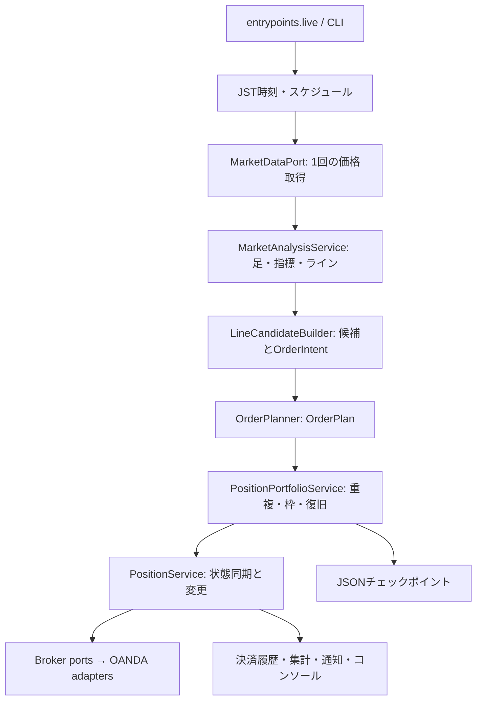

# 構成と処理の流れ

[索引](README.md) / [コード参照](reference/README.md)

## リポジトリの入口

| パス | 役割・扱い |
| --- | --- |
| `src/ogami_oanda/` | 現行プログラム。各Pythonファイルの説明は層別のコード参照を参照 |
| `config/settings.example.yaml` | 公開設定テンプレート。実設定 `config/settings.yaml` は非公開・Git管理外 |
| `tests/` | 現行契約・旧実装との比較・依存制約のオフラインテスト |
| `tests/architecture/` | 層の依存方向と外部I/Oの配置をASTで検査 |
| `tests/differential/` | 固定された旧コミットと現行実装の比較ハーネス、シナリオ、golden |
| `tests/fakes/` | Broker、MarketData、Clock、Notifier、履歴のテスト用実装 |
| `tests/fixtures/` | 比較入力・期待値。詳細は同ディレクトリのREADME |
| `tests/integration/` | 明示的に許可された場合だけ動かすOANDA読み取り検証 |
| `docs/` | 現行の仕様・操作・移行資料。入口は [索引](README.md) |
| `archive/retired/` | 未使用の旧プログラム・過去の文書の圧縮保管。通常は参照しない |
| `archive/classPositionForTest.py` | 名前はarchive配下だが、互換層がimportする現役の比較用依存。移動対象外 |
| `runtime/` | ローカルの履歴・状態・ログ・出力。実行時データでありソースではない |
| `build/differential/` | 差分検証の出力。再生成するローカル成果物 |
| `scripts/check_documentation.py` | 文書リンクと全現行ファイル/定義の参照を検査。`--archives` 指定時だけ圧縮内容も検査 |
| `pyproject.toml` | 依存パッケージ、CLI登録、pytestとRuffの設定 |
| `AGENTS.md` / `.agents/` | このリポジトリのCodex向け作業規約・検証スキル |
| `.github/` | ワークスペース側から同期されるCopilot設定 |
| `.gitignore` / `.rgignore` | ローカルデータのGit除外 / 退役資産の検索除外 |
| `.gitmodules` / `.agent-customizations.manifest` | Gitサブモジュール / 共通エージェント設定の同期メタデータ |

`src/ogami_oanda/infrastructure/runtime/` は現行ソースです。ルートの `runtime/` と混同しません。
`.rgignore` は既存 `.gitignore` の広い `runtime/` 指定を検索時に打ち消し、このソースを表示します。

## 各層の責任

| ディレクトリ | 担当 | コード参照 |
| --- | --- | --- |
| `domain/market/` | 通貨ペアの桁・pips換算、ローソク足のスキーマ | [domain](reference/domain.md) |
| `domain/analysis/` | 指標・ピーク・ライン・値幅の純粋計算 | [domain](reference/domain.md) |
| `domain/orders/` / `domain/positions/` | 注文意図・確定計画・管理状態・イベントの型 | [domain](reference/domain.md) |
| `strategy/original/line/` | 通貨ペア別ライン候補の生成・選択・保護幅・期限判断 | [strategy](reference/strategy.md) |
| `strategy/shared/position_management/` | watching、決済、SL更新、連動・ヘッジの判断 | [strategy](reference/strategy.md) |
| `strategy/original/` | 従来のライン戦略と専用数量計算。起動名original | [戦略一覧](../src/ogami_oanda/strategy/README.md) |
| `strategy/matcha/` | Matcha本体とparameters.yaml。起動名matcha | [strategy](reference/strategy.md) |
| `strategy/shared/` | 共通の戦略契約、ローダー、ポジション管理方針。単独起動不可 | [strategy](reference/strategy.md) |
| `application/ports/` | 市場・発注・照会・時刻・通知・履歴・状態保存のインターフェース | [application](reference/application.md) |
| `application/services/` | 分析、注文計画、ポジション、復旧、集計を組み合わせるユースケース | [application](reference/application.md) |
| `application/` | 業務設定、スケジュール、外部サービス例外の契約 | [application](reference/application.md) |
| `adapters/oanda/` | OANDA要求と応答の変換、市場取得、発注、照会 | [adapters](reference/adapters.md) |
| `adapters/notifications/` / `adapters/repositories/` | Discord通知、CSV履歴、JSONチェックポイント | [adapters](reference/adapters.md) |
| `adapters/legacy/` | 旧dict・オブジェクトと現行型との互換変換。退役資産ではない | [adapters](reference/adapters.md) |
| `infrastructure/config/` | YAML・環境変数・旧tokensからの設定構築 | [infrastructure](reference/infrastructure.md) |
| `infrastructure/runtime/` / `infrastructure/logging/` | JST時計、固定間隔ループ、日次ログ・圧縮 | [infrastructure](reference/infrastructure.md) |
| `entrypoints/` | 依存を組み立て、CLI・liveループ・表示・practice受入を起動 | [entrypoints](reference/entrypoints.md) |
| `backtest/` | 現在はパッケージ入口のみ。決済判定実装はapplicationのBacktestSimulator | [backtest](reference/backtest.md) |

`domain` は他層に依存せず、`strategy` はdomainに、`application` はdomainとstrategyに依存します。
外部I/Oはadapter、実時計・sleepはinfrastructureに置き、entrypointが全体を組み立てます。
実時計をruntime配下へ限定する規約に対し、日次ログの既存実装に違反が残っています。
[整理時の検証記録](archive-policy.md) に記載しています。
詳細な許可依存は [アーキテクチャ](architecture-migration.md) と
[依存制約テスト](../tests/architecture/test_dependency_rules.py) を参照してください。

## 組込みライン戦略の1 tick

図は通常の解析経路です。起動時の照合が完了しない場合は解析・新規注文を停止します。
日曜、週末、スプレッド、時刻で分岐し、ポジション同期だけ行うtickもあります。
Matchaでは `StrategyLiveApplication` が `TradingStrategy.decide()` に市場データを渡し、
返されたcommandとintentを同じポート・ポートフォリオへ渡します。

## ルートに残すPythonファイル

| ファイル | 残す理由 |
| --- | --- |
| `main_exe.py`, `main_exe_euro.py`, `main_exe_aud.py` | 新しいlive構築処理に委譲する従来の起動口 |
| `fAnalysis_order_Main.py`, `fLineAnalysis.py` | 旧分析APIの互換窓口と比較oracle |
| `classPositionControl.py`, `classPosition.py` | 15枠の旧表示/API、旧Positionの比較対象 |
| `classOrderCreate.py` | 旧注文生成の比較対象 |
| `classCandleAnalysis.py`, `classCandlePeaks.py` | 旧分析結果の比較対象 |
| `fLineStrategyUsdJpy.py`, `fLineStrategyEurUsd.py`, `fLineStrategyAudUsd.py` | 旧ライン戦略の比較用依存 |
| `classOanda.py`, `classInspection.py` | 旧API・検証処理の比較用依存 |
| `fGeneric.py`, `send_notice.py` | 上記互換層と比較テストが使用する共通処理 |

「新liveから未参照」と「削除・移動してよい」は別の判定です。
移動しなかったファイルの詳細は [移行マップ](migration-map.md) を参照してください。
